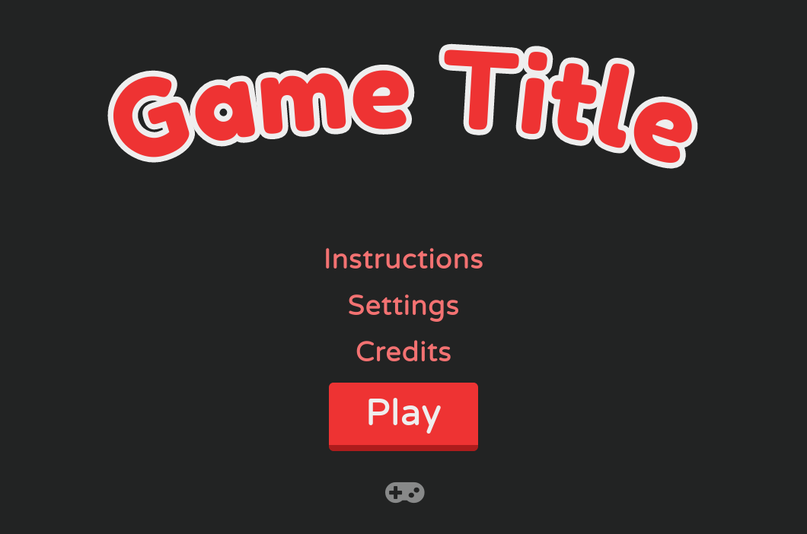

This is a minimal HTML5 game boilerplate / framework.
For making basic 2d keyboard controlled games.

HypeFrame takes care of the annoying boilerplate stuff so you can concentrate on the game.
You can use whatever game engine you like such as Three.js, Photon, or even React and other web frameworks.

Here is a list of the stuff it takes care of:

 * Screens management (splash, title, settings, game screen).
 * Menus.
 * Keyboard, Touch screen, and gamepad inputs.
 * CSS effects stylesheet.

Touch screen is supported by mapping on-screen arrows to virtual key presses.
Gamepad is supported by mapping inputs to virtual key presses.

HypeFrame uses browser capabilities wherever possible.
For example it uses native DOM elements and CSS instead of Canvas.

# Use it

1. [Download a zip](https://github.com/chr15m/HypeFrame/archive/refs/heads/main.zip) of the code, or check out the code with `git`.
2. Started editing.

# Dev

If you use Node you can install the deps and run the local server with: `npm run watch`.
